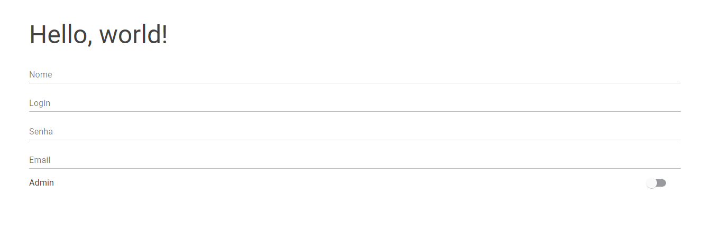

# AutoForm

This is a library to make automated forms in Blazor.

⚠️**Warning**: It is under heavy development, and is not yet ready for use.⚠️

## Nuget Package

**AutoForm**:

[](https://nuget.org/packages/AutoForm)
[](https://nuget.org/packages/AutoForm)

**AutoForm.MudComponents**:

[](https://nuget.org/packages/AutoForm.MudComponents)
[](https://nuget.org/packages/AutoForm.MudComponents)

## Features
- Custom form fields
- Automatically generate form fields from a C# class
- Customization options such as priority, allow list, block list.
- AutoForm.MudComponents package already has basic fields created.


## To-Do
- Add support for data validation from attributes
- Make custom field example
- Document AutoForm.AutoFieldBuilders.Create(ExtraLib); and make examples


## Getting Started

Add using AutoForm to _Imports.razor

```csharp
@using AutoForm
```

Just add this line to your Program.cs

```csharp
AutoForm.AutoFieldBuilders.Create();
```

Like this:

```csharp
using Microsoft.AspNetCore.Components.Web;
using Microsoft.AspNetCore.Components.WebAssembly.Hosting;

++ AutoForm.AutoFieldBuilders.Create();

var builder = WebAssemblyHostBuilder.CreateDefault(args);
...
```

This will scan your project for classes that implements IBuildableComponent and will register them so they can be used in the AutoFields component to create them.

After registering the custom fields, you can use the AutoFields component inside any blazor component and the fields will be created automagically for you.

Class Model example:
```csharp
public class MyUserModel
{
    [FieldOptions("Nome", 0)]
    public string Name { get; set; } = null!;
    
    [FieldOptions("Login", 1)]
    public string Login { get; set; } = null!;
    
    [FieldOptions("Senha", 2)]
    public string Password { get; set; } = null!;
    
    [FieldOptions("Email", 3)]
    public string? Email { get; set; }

    [FieldOptions(false)]
    public string WeDontWantThisOne { get; set; } = null!;
    
    public bool Admin { get; set; } = false;
}
```

Blazor Component example:

```html
<EditForm Model="@User">
    <AutoFields Model="@User"/>
</EditForm>

@code
{
    public MyUserModel User = new ();
}
```

And we get a nice form!



## Examples

- Bootstrap WASM WIP
- Bootstrap Server WIP
- [MudBlazor WASM WIP](https://github.com/MarioGK/AutoForm/tree/main/src/Examples/MudBlazorServer)
- [MudBlazor Server](https://github.com/MarioGK/AutoForm/tree/main/src/Examples/MudBlazorServer)